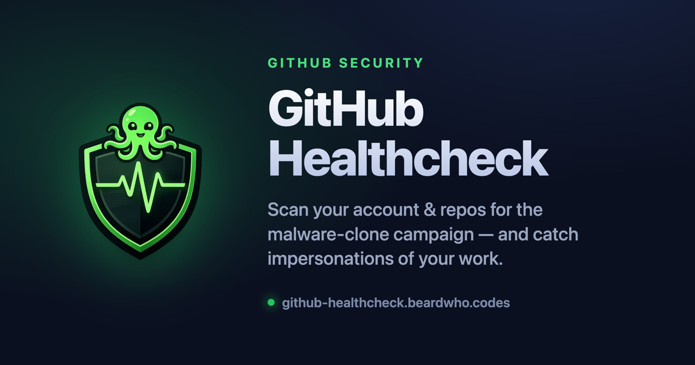

<div align="center">



<p><strong>Sign in with GitHub and get a security report on your account, your repositories, and any clones of your work.</strong></p>

<p>
  <a href="https://github.com/beardwhocodes/github-healthcheck/actions/workflows/deploy.yml"></a>
  <a href="LICENSE"></a>
  
  
</p>

<p>
  <a href="https://github-healthcheck.beardwho.codes"><strong>🔗 Live demo</strong></a> &nbsp;·&nbsp;
  <a href="#the-threat">The threat</a> &nbsp;·&nbsp;
  <a href="#how-detection-works">How it works</a> &nbsp;·&nbsp;
  <a href="#quickstart">Quickstart</a> &nbsp;·&nbsp;
  <a href="#architecture">Architecture</a>
</p>

</div>

---

## What it does

Attackers are cloning real, popular repositories and weaponizing them with a single poisoned README. **GitHub Healthcheck** finds them — and finds the ones impersonating *you*.

|  |  |
| --- | --- |
| 🔬 &nbsp;**Self-audit** | Scores every repository you own against the campaign's indicators. |
| 🪪 &nbsp;**Clone / impersonation detection** | Searches GitHub for malicious verbatim copies of *your* repos. |
| 📊 &nbsp;**Account trust score** | A 0–100 risk grade for the whole account — age, 2FA, clustered activity. |
| 🔔 &nbsp;**Ongoing alerts** | A daily background scan emails you the moment a *new* clone of your work appears. |

You can also **vet any repo or account before trusting it** — handy for repositories surfaced by search or suggested by an AI coding agent, a primary target of this campaign.

---

## The threat

Attackers clone a real, popular repository *verbatim* — full commit history, contributor list, and README — under a throwaway account (**not** a GitHub fork, so it reads as original). They change exactly one thing: the README gets a single `Update README.md` commit adding a download link to a password-protected ZIP.

That ZIP contains a LuaJIT loader (`loader.exe` / `unit.exe` / `boot.exe` / `lua51.dll` + a `.cmd` launcher) that pulls SmartLoader → StealC. The download link scans **clean** on VirusTotal — only the extracted ZIP trips antivirus. **~10,000 such repos sat undetected for over a year.** GitHub Healthcheck encodes the exact tells the researcher used to find them.

> 📄 Documented by [orchidfiles](https://orchidfiles.com/github-repositories-distributing-malware/) and the [r/github warning](https://www.reddit.com/r/github/comments/1isxhas/) that new repositories are being cloned and weaponized.

---

## How detection works

Heuristics are adapted from the public disclosure and the author's source-available CLI, [`git-malware-finder`](https://github.com/orchidfiles/git-malware-finder) (no license file upstream — see [`THIRD-PARTY-NOTICES.md`](THIRD-PARTY-NOTICES.md)). The detection engine (`src/engine/`) is **pure and fully unit-tested**. Per repository it checks:

| Signal | Why it matters |
| --- | --- |
| README references a binary/archive (`.zip`, `.exe`, `.dll`, …) | The only payload a weaponized clone adds. |
| Download **badges** (shields.io) → archive | Real docs replaced with download buttons funneling to one ZIP. |
| **Password-protected** archive language | Deliberate AV / VirusTotal evasion. |
| URL shortener / anon file host (`bit.ly`, `mega.nz`, `t.me`…) | Hides and rotates the payload URL. |
| "free / cracked / full version" lures next to a binary | Social-engineering hook. |
| **Latest commit changed only the README** | The single clearest tell of a weaponized clone. |
| Trivial `Update README.md` commit message | Every malicious clone shared this. |
| Dormant code, suddenly-bumped README | A long gap then a lone README change re-activates a clone. |
| Many inherited contributors, one recent README editor | History inherited from the clone, not earned. |
| Release asset named `loader.exe` / `lua51.dll` / `*.cmd` | The campaign's rotating payloads. |
| Loader / launcher / `.cso` committed in the tree | The exact ZIP file set, in the repo. |
| Archive buried deep in the tree | Payload disguised as a release artifact. |

**Account-level:** brand-new account, 2FA disabled (self only), repos created in a burst, multiple archive-pushing READMEs, many repos with near-zero social footprint. Findings combine into a diminishing-returns 0–100 score and a band: `safe → low → elevated → high → critical`.

> 🛟 **Safe by construction.** GitHub Healthcheck only ever calls `api.github.com`. It analyzes README and link **text** — it never downloads or executes any archive, and never fetches a user-supplied URL (no SSRF surface).

---

## Architecture

TypeScript end-to-end on Cloudflare — one platform for auth, data, scheduling, and email:

```
React + Vite SPA  ──>  Cloudflare Worker (Hono)  ──>  GitHub REST / GraphQL
   web/                src/                            api.github.com
                       ├─ engine/   pure detection rules + scoring (unit-tested)
                       ├─ github/   API client, snapshots, clone detection
                       ├─ auth/     GitHub OAuth, AES-GCM-encrypted sessions
                       ├─ routes/   /api/me · /report · /scan · /clones · /alerts
                       └─ alerts/   D1 store, email, daily cron re-scan
                              │
                       D1 (SQLite)  +  Cron Trigger (daily)  +  Email (Cloudflare)
```

- **Sessions** are server-side: the GitHub token is AES-GCM encrypted at rest in D1; the browser cookie holds only an opaque, high-entropy id (`httpOnly`, `Secure`, `SameSite=Lax`).
- **OAuth** requests least privilege: `read:user` for public scans, `repo` only if the user opts into private repos. CSRF `state` is HMAC-signed.
- **Alerts** store an encrypted long-lived token so the daily Cron Trigger can re-search on the user's behalf, diff against a baseline of known clones, and email only the *new* ones.

---

## Quickstart

```bash
pnpm install
cp .dev.vars.example .dev.vars     # then fill in the values below
pnpm db:init                       # create local D1 tables
pnpm dev                           # SPA on :5173, Worker API on :8787 (proxied)
```

Open <http://localhost:5173>.

**`.dev.vars`** (gitignored) needs:

- `GITHUB_CLIENT_ID` / `GITHUB_CLIENT_SECRET` — from a GitHub OAuth App ([create one](https://github.com/settings/developers)):
  - Homepage URL: `http://localhost:8787`
  - Authorization callback URL: `http://localhost:8787/auth/callback`
- `SESSION_SECRET` — `openssl rand -hex 32` (also encrypts GitHub tokens at rest; must be ≥ 32 chars)

Email is sent via the Cloudflare Email Sending `EMAIL` binding — no API key needed. In dev, Vite (`:5173`) proxies `/api` + `/auth` to wrangler (`:8787`), so the OAuth callback must point at `:8787`.

### Scripts

| Script | Does |
| --- | --- |
| `pnpm dev` | Run the SPA + Worker together |
| `pnpm test` | Detection-engine + unit tests |
| `pnpm test:integration` | Workers-pool + D1 integration tests |
| `pnpm typecheck` | Typecheck the Worker + SPA |
| `pnpm lint` | Biome lint / format check |
| `pnpm build:web` | Build the SPA into `web/dist` |
| `pnpm db:init` | Apply the D1 schema locally |

---

## Deployment

> **Production deploys run in GitHub Actions on every push to `master`** — never from a developer's machine (`pnpm run deploy` is intentionally a no-op). CI typechecks, tests, builds the SPA, dry-run-bundles the Worker, applies the (idempotent) D1 migrations, then deploys.

<details>
<summary><strong>One-time setup</strong></summary>

1. **Create the Cloudflare resources** (once, by an admin):
   ```bash
   pnpm exec wrangler d1 create github-healthcheck-db   # paste the id into wrangler.jsonc → d1_databases[0].database_id
   ```
   Ensure the parent zone (`beardwho.codes`) is active in the same Cloudflare account — the custom domain lives under it, and wrangler provisions its DNS record + TLS cert on deploy.
2. **Create the production GitHub OAuth App**:
   - Homepage URL: `https://github-healthcheck.beardwho.codes`
   - Authorization callback URL: `https://github-healthcheck.beardwho.codes/auth/callback`

   Put its client id into `wrangler.jsonc` → `vars.GITHUB_CLIENT_ID`.
3. **Set Worker secrets** (persist across deploys — set once):
   ```bash
   pnpm exec wrangler secret put GITHUB_CLIENT_SECRET
   pnpm exec wrangler secret put SESSION_SECRET
   ```
4. **Add Actions secrets** (Settings → Secrets and variables → Actions): `CLOUDFLARE_API_TOKEN` (Workers + D1 + DNS edit), `CLOUDFLARE_ACCOUNT_ID`.
5. **Flip the switch**: add the repo **variable** `DEPLOY_ENABLED=true`. The deploy job is gated on it, so pushes stay green (build + test only) until your Cloudflare setup is ready.

</details>

---

## Fork & self-host

This repo is wired to the maintainer's domain and accounts. To run your own instance, replace these example values:

| What | Where |
| --- | --- |
| App URL | `wrangler.jsonc` → `vars.APP_URL` |
| OAuth client id | `wrangler.jsonc` → `vars.GITHUB_CLIENT_ID` (prod) and `.dev.vars` (local) |
| Custom domain | `wrangler.jsonc` → `routes[0].pattern` |
| Email sender domain | `wrangler.jsonc` → `send_email[0].allowed_sender_addresses` |
| Alert from-address | `wrangler.jsonc` → `vars.ALERT_FROM_EMAIL` |
| SPA sender (inbox deep-links) | `web/src/mailProvider.ts` `SENDER`, or build-time `VITE_ALERT_FROM_EMAIL` |
| Bootstrap admin login(s) | `ADMIN_LOGINS` env var (comma-separated) — `wrangler.jsonc` `vars` in prod, `.dev.vars` locally |
| Support / donate URL | `web/src/components/SupportButton.tsx` → `SUPPORT_URL` |

Keep `wrangler.jsonc` `ALERT_FROM_EMAIL` and the SPA `SENDER` in agreement so the "open your inbox" deep-link filters on the address that actually sent the mail.

---

## Security & privacy

- **Text-only, no SSRF.** Only `api.github.com` is ever called; no archive is downloaded or executed, and no user-supplied URL is fetched.
- **Credentials at rest.** GitHub tokens are AES-GCM encrypted; session ids are stored hashed.
- **Erase everything.** The **Alerts** tab → **Delete account**, or `DELETE /api/me`, revokes the GitHub grant and deletes all stored data.
- Found a vulnerability? See [`SECURITY.md`](SECURITY.md) — please report privately.

---

## Tech stack

**Cloudflare Workers** (Hono) · **D1** (SQLite) · **Cron Triggers** · **Cloudflare Email** · **React 19** + **Vite** · **TypeScript** · **Biome** · **Vitest** (`@cloudflare/vitest-pool-workers`) · **pnpm**

Heuristics are data-driven (`src/engine/constants.ts`) — extend the vocabulary as the campaign evolves without touching rule logic. Scans are capped (default 30 repos per account; top-10 most-starred, max 15, for clone search) to stay within GitHub's rate budget; caps are configurable.

---

## License

[MIT](LICENSE) © Josh Tomaino. Detection methodology is adapted from a public disclosure with attribution — see [`THIRD-PARTY-NOTICES.md`](THIRD-PARTY-NOTICES.md).
